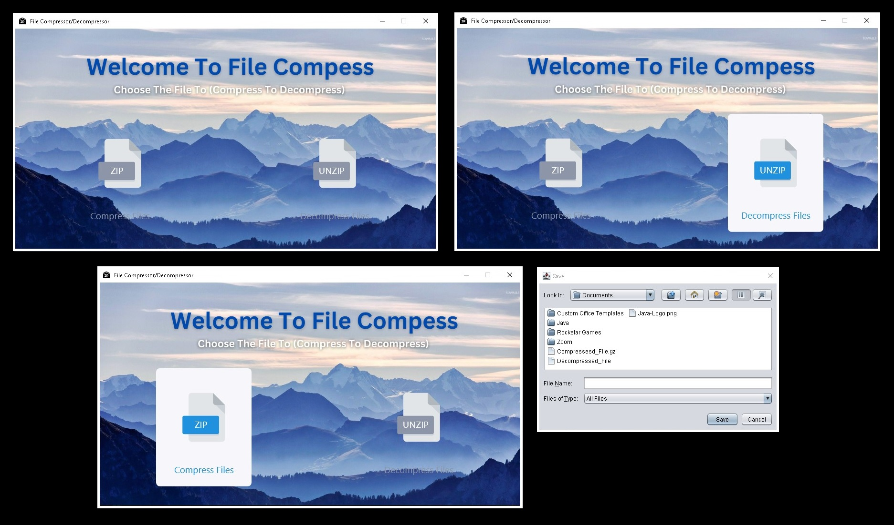

[![Contributors][contributors-shield]][contributors-url]
[![Forks][forks-shield]][forks-url]
[![Stargazers][stars-shield]][stars-url]
[![Issues][issues-shield]][issues-url]
[![LinkedIn][linkedin-shield]][linkedin-url]
 
 

<!-- PROJECT LOGO -->

  

  <h3 align="center">Compress Decompress Java Project</h3>
  
  

    <a href="https://github.com/Shrutika-Haral/Compressor_Decompressor_Files"><strong>Explore the repository »</strong></a>
     
     
    <a href="https://github.com/Shrutika-Haral/Compressor_Decompressor_Files">View Code</a>
    ·
    <a href="https://github.com/Shrutika-Haral/Compressor_Decompressor_Files/issues">Report Bug</a>
    ·
    <a href="https://github.com/Shrutika-Haral/Compressor_Decompressor_Files/issues">Request Feature</a>
  

<!-- TABLE OF CONTENTS -->

  
Table of Contents

  <ol>
    <li>
      <a href="#Introduction">Introduction</a>
    </li>
    <li><a href="#Description">Description</a></li>
    <li><a href="#Features">Features</a></li>
    <li><a href="#Usage">Usage</a></li>
    <li><a href="#How-does-it-work?">How does it work?</a></li>
    <li><a href="#Project-Requirements">Project Requirements</a></li>
    <li><a href="#License">License</a></li>
    <li><a href="#Contact">Contact</a></li>
  </ol>

<!-- Introduction -->
## Introduction
<b>Compress Decompress Java Project</b>

The Compress Decompress Java Project is a Java-based utility that provides functionality for compressing and decompressing files using various compression algorithms. This project aims to simplify the process of compressing files to reduce their size for storage or transmission, as well as decompressing them to their original form. It can be used as a standalone application or integrated into other Java projects.

<!-- Description -->
## Description

The project utilizes the Java programming language and provides a user-friendly interface to interact with compression and decompression functionalities. It supports multiple compression algorithms, GZIP The project employs efficient compression techniques to minimize the file size while ensuring data integrity during the decompression process.

<!-- Features -->
## Features

1. Compression: The project enables users to compress one or multiple files into a single compressed file using various compression algorithms.
2. Decompression: Users can decompress compressed files and restore them to their original format.
Algorithm Selection: The project supports multiple compression algorithms, allowing users to choose the most suitable one for their needs.
3. Progress Tracking: Users can monitor the progress of compression and decompression operations through a progress bar or status updates.
4. File Integrity: The project ensures that the decompressed files maintain data integrity, providing error checking and verification mechanisms.
5. Command-Line Interface: It offers a command-line interface for automation and integration into scripts or other applications.

<!-- Usage -->
## Usage

Clone or download the project repository from GitHub.
Import the project into an Integrated Development Environment (IDE) such as Eclipse or IntelliJ.
Build the project to resolve dependencies and compile the code.
Use the provided APIs or command-line interface to perform compression and decompression operations.
Refer to the project documentation or code examples for detailed usage instructions and integration guidelines.

<!-- How-does-it-work? -->
## How-does-it-work?

The project utilizes Java's built-in libraries and compression APIs to implement the compression and decompression functionalities. It abstracts the underlying compression algorithms and provides a unified interface for users to interact with. When compressing files, the project reads the input files, applies the selected compression algorithm, and generates a compressed output file. During decompression, it reads the compressed file, applies the corresponding decompression algorithm, and restores the original files.

<!-- Project-Requirements -->
## Project-Requirements

To use the Compress Decompress Java Project, you need the following requirements:

Java Development Kit (JDK) installed on your system.
An Integrated Development Environment (IDE) like Eclipse or IntelliJ for importing and building the project.
Basic knowledge of Java programming and file handling concepts.
The project repository on GitHub should contain the following:

**Source code files for the project.**
Documentation or README file explaining the project, its features, and usage instructions.
Sample code examples or usage scenarios.
License file specifying the project's license (e.g., MIT, Apache, etc.).
Note: The above information is a general outline of what could be included in a Compress Decompress Java Project. The actual implementation and details may vary depending on the specific requirements and design choices of the project.

<!-- LICENSE -->
## License

This Project is released under the [IntelliJ IDEA 2023.1.1 (Community Edition)]. See the `LICENSE` file for more information.

<!-- CONTACT -->
## Contact

Project Link: [https://github.com/Shrutika-Haral/Compressor_Decompressor_Files](https://github.com/Shrutika-Haral/Compressor_Decompressor_Files)

<!-- MARKDOWN LINKS & IMAGES -->
<!-- https://www.markdownguide.org/basic-syntax/#reference-style-links -->
[contributors-shield]: https://img.shields.io/github/contributors/jihedkdiss/jSnake.svg?style=for-the-badge
[contributors-url]: https://github.com/Shrutika-Haral/Compressor_Decompressor_Files/graphs/contributors
[forks-shield]: https://img.shields.io/github/forks/jihedkdiss/jSnake.svg?style=for-the-badge
[forks-url]: https://github.com/Shrutika-Haral/Compressor_Decompressor_Files/network/members
[stars-shield]: https://img.shields.io/github/stars/jihedkdiss/jSnake.svg?style=for-the-badge
[stars-url]: https://github.com/Shrutika-Haral/Compressor_Decompressor_Files/stargazers
[issues-shield]: https://img.shields.io/github/issues/jihedkdiss/jSnake.svg?style=for-the-badge
[issues-url]: https://github.com/Shrutika-Haral/Compressor_Decompressor_Files/issues
[linkedin-shield]: https://img.shields.io/badge/-LinkedIn-black.svg?style=for-the-badge&logo=linkedin&colorB=555
[linkedin-url]: https://www.linkedin.com/in/shrutika-haral

